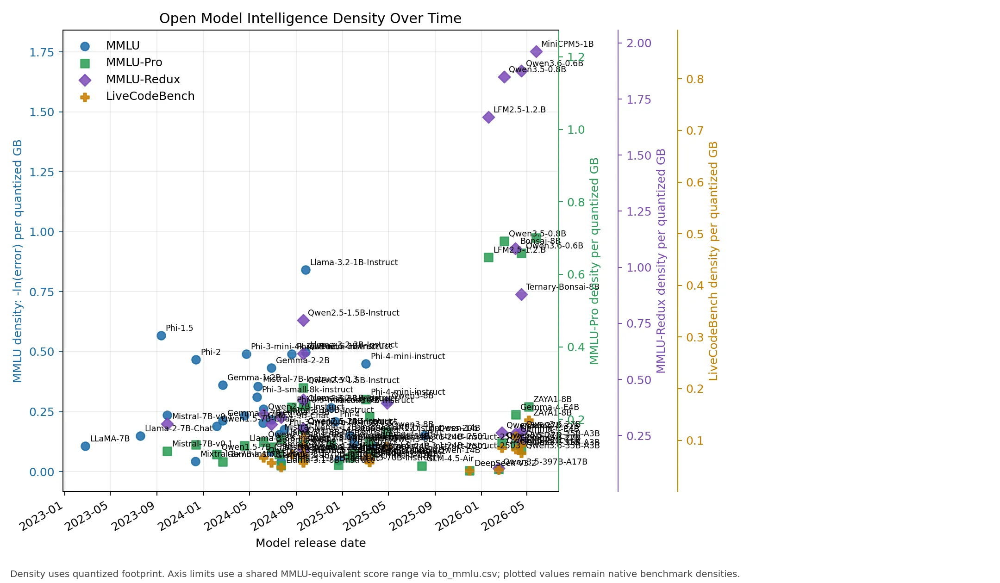
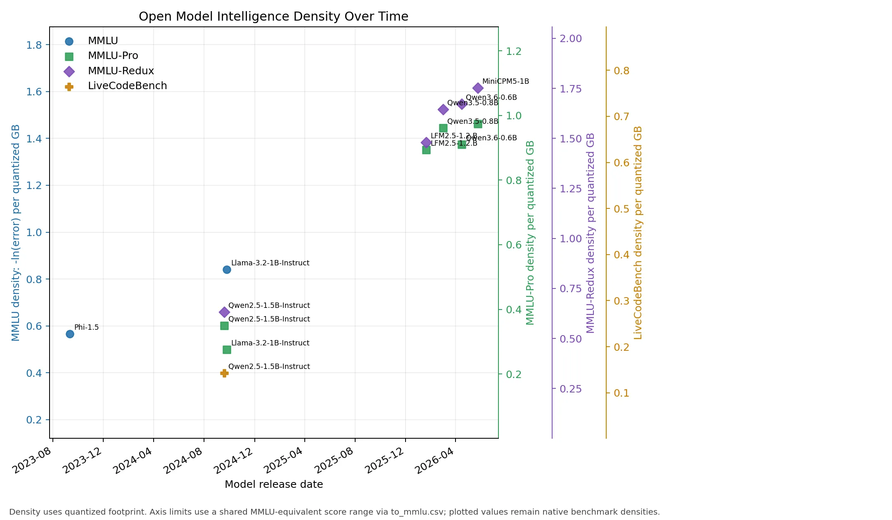
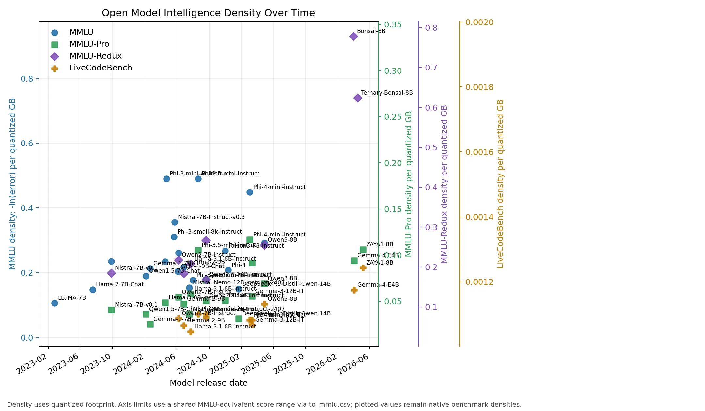
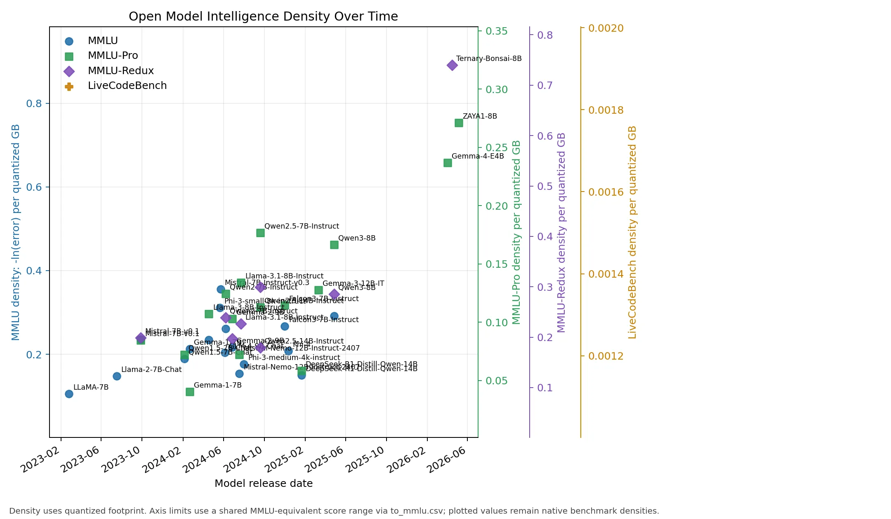

# Model Intelligence Density in Open Language Models, 2023-2026

**Author:** Don Mahurin
**Date:** May 7, 2026

## Abstract

Open language models have improved through scale, data, training procedure, architecture, distillation, and quantization. This paper studies a narrower deployment-oriented question: how much measured model capability is obtained per gigabyte of commonly available model artifact. We define **model intelligence density** as the negative log of benchmark error divided by quantized model size, `-ln(1 - R/100) / S`, where `R` is a benchmark score and `S` is the quantized footprint in gigabytes. Using a curated dataset of open or commonly downloadable models from 2023 through 2026, we find that compact models increasingly dominate density even when larger models retain higher absolute benchmark scores. Phi, Llama 3.2, Qwen2.5/Qwen3, Gemma, Zyphra ZAYA1, and Bonsai-family rows show much higher per-gigabyte density than early 2023 7B baselines. We also find that LiveCodeBench correlates much better with MMLU-Pro than SWE-Bench-Pro in this dataset, and therefore serves as a more useful coding benchmark for cross-metric scaling.

## Keywords

language models; quantization; GGUF; MXFP4; NVFP4; NF4; MMLU; MMLU-Pro; MMLU-Redux; LiveCodeBench; SWE-Bench-Pro; benchmark normalization; deployment efficiency

## Introduction

Open-weight language models are often compared by absolute benchmark score. That comparison is useful for frontier capability, but it is incomplete for local deployment. A user choosing among Q4_K_M, MXFP4, NVFP4, or lower-bit artifacts also cares about how much capability fits into a given memory or storage budget. A model that is slightly less capable in absolute terms may be much more valuable if it reaches that capability at one quarter of the footprint.

This paper evaluates that deployment-efficiency view. We collect release dates, quantized model sizes, and benchmark values for open or commonly available models between 2023 and 2026. We then compute benchmark-specific density values and plot them over time. Because not all models report the same benchmarks, we fit simple linear conversions into MMLU-equivalent score space for axis scaling. The plotted values remain native benchmark densities.

The central claim is empirical and limited: within the collected open-model dataset, intelligence density has improved materially since 2023. The highest-density points are usually compact models or aggressively quantized models, not the largest available checkpoints.

## Background / Related Work

The dataset follows several public benchmark families. MMLU measures broad multitask academic knowledge; MMLU-Pro is a harder variant; MMLU-Redux attempts to address issues in the original MMLU set; LiveCodeBench measures code generation over time-varying programming tasks; and SWE-Bench-Pro measures agentic software-engineering performance. These benchmarks differ in task format, scoring rules, and sensitivity to prompting or scaffolding, so this paper treats conversion across them as an approximate plotting aid rather than a claim of equivalence.

The model families considered include LLaMA/Llama, Falcon, Mistral/Mixtral, DeepSeek, Qwen, Gemma, Phi, GPT-OSS, GLM, Bonsai, and Zyphra. Later dataset revisions also examined several 6-9B peer models such as OLMo 3 7B, RNJ/Rnj-1, GLM v6 9B, and Trinity Nano-style rows for coding-benchmark coverage. Those models were not added unless a compatible benchmark value and low-bit footprint were both sourceable.

Prior work and model-release materials establish the timeline and benchmark context: Meta's LLaMA and Llama releases, Mistral's 7B/Mixtral/Small releases, Microsoft's Phi reports, Google's Gemma model cards, Qwen's model cards and benchmark tables, DeepSeek and GLM model cards, OpenAI's GPT-OSS release, and PrismML's Bonsai announcements. Quantized footprints are primarily sourced from GGUF, MXFP4, NVFP4, or Bonsai artifacts.

## Problem Statement / Preliminaries

Let a model row contain:

- release date;
- full-precision or reference model footprint;
- quantized artifact footprint `S`, in gigabytes;
- one or more benchmark scores `R`, in percent.

For each available benchmark score, define model intelligence density as:

```text
density(R, S) = -ln(1 - R / 100) / S
```

The negative-log transform treats error reduction multiplicatively. For example, improving from 90% to 95% halves the remaining error and is not equivalent to improving from 50% to 55%. Dividing by quantized footprint makes the metric deployment-oriented.

The study asks:

1. How has benchmark density changed over time for open models?
2. Which model sizes and families appear on the density frontier?
3. Which benchmark axes have enough overlap to support useful cross-metric scaling?

## Approach / Methods / System Design

The pipeline has four stages.

First, `llm.csv` stores one row per model with metadata and benchmark scores. Models are included when they are commonly available in MXFP4, NVFP4, NF4, Q4_K_M, or, for Bonsai, Q_1/Q_1.58/Q_2-style formats.

Second, `correlate.py` fits linear conversions from each benchmark into MMLU-equivalent score space. MMLU is the identity mapping. MMLU-Pro and MMLU-Redux are fitted directly against rows that also have MMLU. Coding benchmarks are fitted against MMLU-Pro and then composed with the MMLU-Pro-to-MMLU conversion, because no rows currently have direct overlap between SWE-Bench-Pro and MMLU.

Third, `plot_density.py` computes benchmark-native density values and plots them by release date. Axis limits are scaled through the MMLU-equivalent conversions so that MMLU, MMLU-Pro, MMLU-Redux, and LiveCodeBench appear on comparable vertical ranges. SWE-Bench-Pro remains supported but is disabled by default because its correlation remains weak.

Fourth, `correlation-diagnostics.csv` records the overlap count and R² for each fitted relationship. This prevents weak fits from being hidden behind slope/intercept values.

## Implementation

The implementation is intentionally small and reproducible:

```bash
python3 correlate.py
python3 plot_density.py
```

The main inputs are:

- `llm.csv`: model metadata, quantized footprints, and benchmark values.

The main outputs are:

- `to_mmlu.csv`: fitted conversion coefficients.
- `correlation-diagnostics.csv`: overlap counts and R² values.
- `density.webp`: chart used in this paper.

`plot_density.py` includes a display control:

```python
DISABLED_BENCHMARKS = {"SWE-Bench-Pro"}
```

Changing this set enables or disables specific plotted benchmark axes without removing the data from `llm.csv`.

## Evaluation / Experiments / Results

The analysis shows a clear upward trend in intelligence density across all model categories from 2023 to 2026. This trend is visible not only in the overall dataset but also when models are grouped by parameter count, indicating that density gains are being achieved at every scale of model development.

### Overall Density Trend



### Density Trends by Model Size

To better visualize the scaling behavior, we categorize models by total parameter count:

- **Small (<= 3.5B):** 
- **Medium (> 3.5B <= 15B):** 
- **Large (> 15B <= 36B):** 

### Correlation Results

The current fitted conversion coefficients are:

| Benchmark | Slope to MMLU | Intercept |
|---|---:|---:|
| MMLU | 1.00000000 | 0.00000000 |
| MMLU-Pro | 0.52329887 | 46.98645268 |
| MMLU-Redux | 0.70304385 | 23.36019342 |
| SWE-Bench-Pro | 0.04644627 | 89.76589501 |
| LiveCodeBench | 0.31364091 | 66.13689039 |

The diagnostics show that LiveCodeBench is the better coding benchmark for this dataset:

| Benchmark | Fit path | n | R² |
|---|---|---:|---:|
| MMLU | identity | 0 | 1.00000000 |
| MMLU-Pro | MMLU-Pro -> MMLU direct | 18 | 0.83540700 |
| MMLU-Redux | MMLU-Redux -> MMLU direct | 4 | 0.99910584 |
| SWE-Bench-Pro | SWE-Bench-Pro -> MMLU-Pro, composed | 6 | 0.35087919 |
| LiveCodeBench | LiveCodeBench -> MMLU-Pro, composed | 21 | 0.92173641 |

SWE-Bench-Pro has too little overlap and too much harness variation to serve as a reliable scaling axis. LiveCodeBench is not perfectly uniform either, because the dataset combines LiveCodeBench 2305-2409, LiveCodeBench v6, and third-party mirrors, but it is much better supported for 5-8GB-class and mid-sized open models.

### Density Results

The early 2023 baseline is sparse and mostly 7B-class. LLaMA-7B has MMLU 35.1 at a 4.08 GB Q4_K_M footprint, giving an MMLU density of about 0.105. Llama-2-7B-Chat improves to MMLU 45.3 at the same quantized footprint, or about 0.148.

By late 2023 and 2024, compact models become much denser. Phi-1.5 reaches MMLU 37.6 with a 0.832 GB Q4_K_M artifact. Phi-2 reaches MMLU 56.7 with a 1.79 GB Q4_K_M artifact, producing about 0.468 MMLU density. Phi-3-mini-4k-instruct and Phi-3.5-mini-instruct reach approximately 0.490 MMLU density at a 2.39 GB quantized footprint. Llama-3.2-1B-Instruct is one of the strongest native MMLU-density points: MMLU 49.3 at 0.808 GB, or about 0.841. MiniCPM5-1B, Qwen3.6-0.6B, Qwen3.5-0.8B, and LFM2.5-1.2.B represent the 2026 density frontier for sub-2GB artifacts. MiniCPM5-1B reaches MMLU-Redux 70.06 at only 0.688 GB [76, 80], while LFM2.5-1.2.B reaches MMLU-Pro 47.98 at 0.731 GB [78, 83]. Qwen3.5-0.8B [77, 82] and Qwen3.6-0.6B [79, 81] further extend the frontier for extremely small footprints.

Qwen2.5 clarifies the size/capability tradeoff. Qwen2.5-1.5B-Instruct and Qwen2.5-3B-Instruct are strong MMLU-Pro and MMLU-Redux density points. Larger Qwen2.5 7B, 14B, and 32B rows improve absolute scores but at progressively lower density.

Gemma, Zyphra, and Bonsai highlight different forms of density improvement. Gemma-4-E4B reaches MMLU-Pro 69.4 at an estimated 5.0 GB Q4-class footprint. ZAYA1-8B reaches MMLU-Pro 74.2 and LiveCodeBench-v6 65.8 at approximately 5.0 GB in NF4, adding a compact MoE point with high coding density. Bonsai-8B reports MMLU-Redux 65.7 at 1.15 GB, and Ternary-Bonsai-8B reports MMLU-Redux 72.6 at 1.75 GB. Their native MMLU-Redux densities are about 0.930 and 0.740, respectively.

Very large sparse and mixture-of-experts models often have high absolute scores but lower density. Qwen3.5-397B-A17B, Qwen3.6-27B, Qwen3.6-35B-A3B, GLM-5.1, and DeepSeek-V3.2 are valuable capability points, but their quantized artifacts are much larger than compact models.

## Discussion

The data supports three conclusions.

First, benchmark density has improved substantially since 2023. The leading native MMLU-density points move from roughly 0.10-0.15 for early LLaMA/Llama 2 7B rows to roughly 0.47-0.84 for Phi, Llama 3.2, and other compact 2024 models. Bonsai rows extend the density frontier through extreme low-bit formats.

Second, density and absolute capability are separate optimization targets. Large models usually remain stronger on absolute capability, especially for difficult reasoning and coding tasks, but compact models can dominate capability per quantized gigabyte.

Third, benchmark choice matters. MMLU-Pro and LiveCodeBench have enough overlap to support useful approximate scaling in this dataset. SWE-Bench-Pro does not. For this reason, SWE-Bench-Pro remains in the dataset and conversion table but is hidden from the default plot.

### Implications of Increasing Density

Increasing intelligence density changes where language models can run. When capability is tied to hundreds of gigabytes of weights, deployment is naturally concentrated in datacenters or large workstation-class systems. As useful benchmark performance moves into tens, single-digit, and eventually near-one-gigabyte artifacts, the deployment boundary shifts outward: local PCs, laptops, mobile devices, browser runtimes, embedded systems, and robotic devices become more plausible targets.

This matters for latency, privacy, availability, cost, and autonomy. A model that runs locally can avoid a network round trip, keep sensitive context on-device, continue operating with intermittent connectivity, and reduce dependence on centralized inference capacity. For robotics and other embodied systems, local inference is especially important because the device may need fast responses, graceful degradation, and operation in environments where datacenter access is unreliable.

Bonsai illustrates the practical implication of the density trend. The Bonsai rows in this dataset are not merely smaller checkpoints; they represent a qualitatively different deployment class. PrismML reports 1-bit Bonsai 8B at 1.15 GB and Ternary Bonsai 8B at 1.75 GB, with the ternary release designed around strict memory constraints and mobile/edge execution [56]. The same release reports native Apple-device deployment through MLX and gives measured throughput on M4 Pro and iPhone-class hardware [56]. The existence of public WebGPU demos for 1-bit Bonsai and Ternary Bonsai further shows that these models can be delivered through a browser runtime, not only through server-side APIs or specialized desktop installations [71, 72]. This is the broader implication of increasing density: language models become less constrained to datacenters and increasingly feasible as local software components.

The claim should not be overstated. Running in a browser, on a Raspberry Pi-class board, or on a robot does not imply frontier performance, and surrounding system costs still matter: context length, KV-cache memory, token throughput, energy budget, sensors, action policies, and safety constraints can dominate the final product. However, density gains lower the minimum viable hardware target. A model that fits in one or two gigabytes can be considered for devices and workflows that would never host a 16-bit 8B checkpoint, much less a 70B or MoE model.

## Related Work

This study is adjacent to work on scaling laws, benchmark design, and quantization. Scaling-law work studies capability as a function of parameters, data, and compute. Benchmark work creates and audits tasks such as MMLU, MMLU-Pro, MMLU-Redux, LiveCodeBench, and SWE-Bench-Pro. Quantization work studies low-bit inference formats and their quality/efficiency tradeoffs. This paper does not propose a new benchmark or quantization method; it combines public benchmark reports with public low-bit artifact sizes to measure deployment density over time.

## Conclusion and Future Work

Open model density has increased markedly since 2023. The strongest density points are generally compact dense models, small instruct models, or aggressive low-bit releases rather than the largest checkpoints. LiveCodeBench is a useful addition because it provides much better coverage and correlation than SWE-Bench-Pro for coding-oriented comparisons.

Future work should add quantized benchmark scores where available, separate base and instruct models more strictly, track uncertainty by source quality, distinguish LiveCodeBench versions more formally, and add direct MMLU-Pro/LiveCodeBench/SWE-Bench-Pro measurements for more small models. Another useful extension would be a Pareto frontier view over absolute score, quantized footprint, and release date.

## Acknowledgements

This paper relies on public model cards, benchmark tables, GGUF/MXFP4/NVFP4/NF4 artifact pages, and release announcements from model developers, benchmark providers, and community quantization maintainers.

## References

1. Meta AI. "LLaMA: Open and Efficient Foundation Language Models." https://ai.meta.com/research/publications/llama-open-and-efficient-foundation-language-models/
2. TheBloke. "LLaMA-7B-GGUF." Hugging Face. https://huggingface.co/TheBloke/LLaMA-7b-GGUF
3. TheBloke. "Llama-2-7B-Chat-GGUF." Hugging Face. https://huggingface.co/TheBloke/Llama-2-7B-Chat-GGUF
4. Meta AI. "Introducing Meta Llama 3.1." https://ai.meta.com/blog/meta-llama-3-1/
5. bartowski. "Meta-Llama-3.1-8B-Instruct-GGUF." Hugging Face. https://huggingface.co/bartowski/Meta-Llama-3.1-8B-Instruct-GGUF
6. NVIDIA NIM. "Llama 3.1 70B Instruct Model Card." https://build.nvidia.com/meta/llama-3_1-70b-instruct/modelcard
7. bartowski. "Meta-Llama-3.1-70B-Instruct-GGUF." Hugging Face. https://huggingface.co/bartowski/Meta-Llama-3.1-70B-Instruct-GGUF
8. NVIDIA NIM. "Llama 3.3 70B Instruct Model Card." https://build.nvidia.com/meta/llama-3_3-70b-instruct/modelcard
9. Mistral AI. "Announcing Mistral 7B." https://mistral.ai/news/announcing-mistral-7b
10. Mistral AI. "Mixtral of Experts." https://mistral.ai/news/mixtral-of-experts
11. tensorblock. "Mistral-7B-Instruct-v0.1-GGUF." Hugging Face. https://huggingface.co/tensorblock/Mistral-7B-Instruct-v0.1-GGUF
12. tensorblock. "Mixtral-8x7B-Instruct-v0.1-GGUF." Hugging Face. https://huggingface.co/tensorblock/Mixtral-8x7B-Instruct-v0.1-GGUF
13. Mistral AI. "Mistral Small 3." https://mistral.ai/fr/news/mistral-small-3
14. Mistral AI. "Mistral Small 3.1 Model Card." https://docs.mistral.ai/models/model-cards/mistral-small-3-1-25-03
15. lmstudio-community. "Mistral-Small-24B-Instruct-2501-GGUF." Hugging Face. https://huggingface.co/lmstudio-community/Mistral-Small-24B-Instruct-2501-GGUF
16. merterbak. "Mistral-Small-3.1-24B-Instruct-2503-GGUF." Hugging Face. https://huggingface.co/merterbak/Mistral-Small-3.1-24B-Instruct-2503-GGUF
17. Qwen. "Qwen2.5." https://qwen2.org/qwen2-5/
18. Qwen. "Qwen2-7B-Instruct." Hugging Face. https://huggingface.co/Qwen/Qwen2-7B-Instruct
19. Qwen. "Qwen2-7B-Instruct-GGUF." Hugging Face. https://huggingface.co/Qwen/Qwen2-7B-Instruct-GGUF
20. Qwen. "Qwen2.5-1.5B-Instruct-GGUF." Hugging Face. https://huggingface.co/Qwen/Qwen2.5-1.5B-Instruct-GGUF
21. Qwen. "Qwen2.5-3B-Instruct-GGUF." Hugging Face. https://huggingface.co/Qwen/Qwen2.5-3B-Instruct-GGUF
22. Qwen. "Qwen2.5-7B-Instruct-GGUF." Hugging Face. https://huggingface.co/Qwen/Qwen2.5-7B-Instruct-GGUF
23. Qwen. "Qwen2.5-14B-Instruct-GGUF." Hugging Face. https://huggingface.co/Qwen/Qwen2.5-14B-Instruct-GGUF
24. Qwen. "Qwen2.5-32B-Instruct-GGUF." Hugging Face. https://huggingface.co/Qwen/Qwen2.5-32B-Instruct-GGUF
25. Qwen. "Qwen3-8B-GGUF." Hugging Face. https://huggingface.co/Qwen/Qwen3-8B-GGUF
26. Qwen. "Qwen3.6-27B." Hugging Face. https://huggingface.co/Qwen/Qwen3.6-27B
27. Qwen. "Qwen3.6-35B-A3B." Hugging Face. https://huggingface.co/Qwen/Qwen3.6-35B-A3B
28. mradermacher. "Qwen3.5-27B-GGUF." Hugging Face. https://huggingface.co/mradermacher/Qwen3.5-27B-GGUF
29. MLX Community. "Qwen3.5-397B-A17B-nvfp4." Hugging Face. https://huggingface.co/mlx-community/Qwen3.5-397B-A17B-nvfp4
30. Google. "Gemma 2 is now available to researchers and developers." https://blog.google/technology/developers/google-gemma-2/
31. Google AI for Developers. "Gemma 3 Model Card." https://ai.google.dev/gemma/docs/core/model_card_3
32. Google. "Gemma 4 launch announcement." https://blog.google/innovation-and-ai/technology/developers-tools/gemma-4/
33. Google AI for Developers. "Gemma 4 Model Card." https://ai.google.dev/gemma/docs/core/model_card_4
34. lm-kit. "gemma-3-4b-instruct-gguf." Hugging Face. https://huggingface.co/lm-kit/gemma-3-4b-instruct-gguf
35. GaiaNet. "gemma-3-12b-it-GGUF." Hugging Face. https://huggingface.co/gaianet/gemma-3-12b-it-GGUF
36. Microsoft Research. "Textbooks Are All You Need." https://www.microsoft.com/en-us/research/publication/textbooks-are-all-you-need/
37. Microsoft Research. "Textbooks Are All You Need II: phi-1.5 technical report." https://arxiv.org/pdf/2309.05463
38. Microsoft Research. "Phi-2: The surprising power of small language models." https://www.microsoft.com/en-us/research/blog/phi-2-the-surprising-power-of-small-language-models/
39. Microsoft Research. "Phi-3 Technical Report." https://www.microsoft.com/en-us/research/publication/phi-3-technical-report-a-highly-capable-language-model-locally-on-your-phone/
40. Microsoft. "Phi-4." Hugging Face. https://huggingface.co/microsoft/phi-4
41. Microsoft. "Phi-4-mini-instruct." Hugging Face. https://huggingface.co/microsoft/Phi-4-mini-instruct
42. bartowski. "phi-4-GGUF." Hugging Face. https://huggingface.co/bartowski/phi-4-GGUF
43. Melvin56. "Phi-4-mini-instruct-GGUF." Hugging Face. https://huggingface.co/Melvin56/Phi-4-mini-instruct-GGUF
44. DeepSeek AI. "DeepSeek-R1-Distill-Qwen-14B." Hugging Face. https://huggingface.co/deepseek-ai/DeepSeek-R1-Distill-Qwen-14B
45. tensorblock. "DeepSeek-R1-Distill-Qwen-14B-GGUF." Hugging Face. https://huggingface.co/tensorblock/DeepSeek-R1-Distill-Qwen-14B-GGUF
46. DeepSeek AI. "DeepSeek-V3.2." Hugging Face. https://huggingface.co/deepseek-ai/DeepSeek-V3.2
47. DevQuasar. "DeepSeek-V3.2-GGUF." Hugging Face. https://huggingface.co/DevQuasar/deepseek-ai.DeepSeek-V3.2-GGUF
48. Z.ai. "GLM-4.5-Air." Hugging Face. https://huggingface.co/zai-org/GLM-4.5-Air
49. mradermacher. "GLM-4.5-Air-GGUF." Hugging Face. https://huggingface.co/mradermacher/GLM-4.5-Air-GGUF
50. Z.ai. "GLM-5.1." Hugging Face. https://huggingface.co/zai-org/GLM-5.1
51. Z.ai. "GLM-5 GitHub Repository." https://github.com/zai-org/GLM-5
52. CortexLM. "GLM-5.1-NVFP4-MTP." Hugging Face. https://huggingface.co/CortexLM/GLM-5.1-NVFP4-MTP
53. OpenAI. "Introducing gpt-oss." https://openai.com/index/introducing-gpt-oss/
54. OpenAI. "gpt-oss-120b and gpt-oss-20b model card / technical report." https://ar5iv.labs.arxiv.org/html/2508.10925
55. Hugging Face. "Transformers MXFP4 documentation." https://huggingface.co/docs/transformers/main/quantization/mxfp4
56. PrismML. "Ternary Bonsai announcement." https://prismml.com/news/ternary-bonsai
57. PrismML. "Ternary-Bonsai-8B-mlx-2bit." Hugging Face. https://huggingface.co/prism-ml/Ternary-Bonsai-8B-mlx-2bit
58. PrismML. "Bonsai-8B GGUF." Hugging Face. https://huggingface.co/prism-ml/Bonsai-8B-gguf
59. Technology Innovation Institute. "Falcon3-7B-Instruct." Hugging Face. https://huggingface.co/tiiuae/Falcon3-7B-Instruct
60. mradermacher. "Falcon3-7B-Instruct-GGUF." Hugging Face. https://huggingface.co/mradermacher/Falcon3-7B-Instruct-GGUF
61. DataLearnerAI. "Code Leaderboard." https://www.datalearner.com/leaderboards/category/code?benchmark=SWE-bench+Multilingual&licenseType=open&modelType=reasoningLLM
62. Easy Benchmarks. "Qwen3-8B Instruct Reasoning." https://easy-benchmarks.com/models/qwen3-8b-instruct-reasoning
63. Benched.ai. "Phi-4 Mini Instruct." https://benched.ai/models/phi-4-mini
64. GraySoft. "phi-2 benchmark results." https://graysoft.dev/models/phi-2
65. BenchLM.ai. "MMLU-Redux snapshot." https://benchlm.ai/benchmarks/mmluRedux
66. DataLearnerAI. "GLM-4.5-Air benchmark summary." https://www.datalearner.com/en/ai-models/pretrained-models/glm-4_5_moe-106b-a12b-0715/analysis
67. Local AI Master. "GLM-4 local deployment summary." https://localaimaster.com/models/glm-4-6
68. Local AI Master. "Gemma 7B local model summary." https://localaimaster.com/models/gemma-7b
69. Continue/Novita. "DeepSeek R1 Distill Qwen 14B." https://hub.continue.dev/novita/deepseek-r1-distill-qwen-14b
70. LLM Explorer. "DeepSeek R1 Distill Qwen 14B." https://llm-explorer.com/model/deepseek-ai/DeepSeek-R1-Distill-Qwen-14B%2C36Sd3mMwX7bEOQliQnKN0d
71. webml-community. "Bonsai 1-bit WebGPU." Hugging Face Spaces. https://huggingface.co/spaces/webml-community/bonsai-webgpu
72. webml-community. "Ternary Bonsai WebGPU." Hugging Face Spaces. https://huggingface.co/spaces/webml-community/bonsai-ternary-webgpu
73. Zyphra. "ZAYA1-8B: Frontier intelligence density, trained on AMD." https://www.zyphra.com/post/zaya1-8b
74. Zyphra. "ZAYA1-8B." Hugging Face. https://huggingface.co/Zyphra/ZAYA1-8B
75. barozp. "ZAYA1-8B bitsandbytes Quantizations." Hugging Face. https://huggingface.co/barozp/ZAYA1-8B-BNB
76. Artificial Analysis. "MiniCPM5-1B Model Details." https://artificialanalysis.ai/models/minicpm5-1b
77. Alibaba Qwen Team. "Qwen3.5 Small Model Series." https://qwenlm.github.io/blog/qwen3.5/
78. Liquid AI. "LFM2.5: Liquid Foundation Models v2.5." https://liquid.ai/blog/liquid-foundation-models-v2-5
79. Alibaba Qwen Team. "Qwen3.6: Preserving Thinking in Agentic Coding." https://qwenlm.github.io/blog/qwen3.6/
80. bartowski. "MiniCPM5-1B-GGUF." Hugging Face. https://huggingface.co/bartowski/MiniCPM5-1B-GGUF
81. bartowski. "Qwen_Qwen3-0.6B-GGUF." Hugging Face. https://huggingface.co/bartowski/Qwen_Qwen3-0.6B-GGUF
82. bartowski. "Qwen_Qwen3.5-0.8B-GGUF." Hugging Face. https://huggingface.co/bartowski/Qwen_Qwen3.5-0.8B-GGUF
83. Liquid AI. "LFM2.5-1.2B-Instruct-GGUF." Hugging Face. https://huggingface.co/LiquidAI/LFM2.5-1.2B-Instruct-GGUF

## Appendices

### Appendix A: Dataset Columns

`llm.csv` contains model name, release date, total parameter count, full-precision/reference size, quantized size, MMLU, MMLU-Pro, MMLU-Redux, SWE-Bench-Pro, LiveCodeBench, and optional quantized benchmark columns.

### Appendix B: Disabled Plot Series

`SWE-Bench-Pro` is disabled by default in `plot_density.py` because its MMLU-Pro overlap fit has only six points and R² 0.351. The data remains in `llm.csv` and `to_mmlu.csv`.
