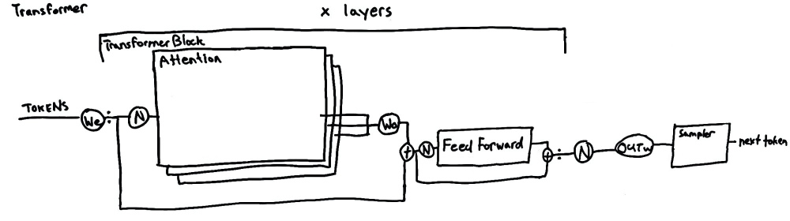
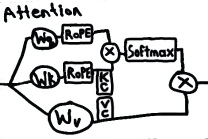
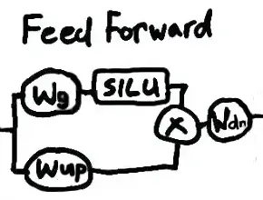

# Large Language Model - predicting text with multiplication

*by Don Mahurin, 2023-10-01*

## Background

A Large Language Model takes an input sequence of words and use a neural network to repeatedly predict he next likely word.

The most popular neural network architecture used for Large Language Models is the Transformer architecture.
The transformer based Llama model, produced by Meta and has become a common reference and inspiration for other models. The transformer architecture of Llama is the subject of this document.

## Weights and matrix multiplication

Most of the processing of a large language model is matrix multiplication. In the description below, all the 'weights' mentioned are matrices of pre-trained values that are multiplied at various places in the model. When sizes of language models are discussed as disk space or memory, this refers to size of the weights. The size of the model software functions are tiny in comparison.

## Predicting tokens from tokens

When text is processed by the model it is processed as tokens (numbers) which represent the words, parts of words or punctuation. The tokens are translated using a vocabulary table.
The tokens are then processed by the transformer, which returns a list of the most likely text tokens to follow.
The next text token is chosen by just picking the top one, or by using an algorithm like top-p which introduces more variation.
The selected token is added back to the input sequence, and the process continues until the end of text or some set limit is reached.

## Transformer Layers

In the transformer, the tokens are initially converted into a vector representation known as an embedding. Subsequently, the input is normalized and passed to each 'Attention head'. The combined output of the heads applies the attention output weights and is added to back to the input. The result is then sent to the feed forward network. This process is repeated for a specified number of layers. After all the layers, the result is normalized again and weighted with the transformer output weights.

## Attention Head

The attention weights capture how relevant each possible token to the input tokens.
Multiple attention heads allow focus on different perspective relationships between the tokens simultaneously.

An attention head in a transformer model applies the weight matrices, Wq, Wk, Wv, to form the query(Q), key(K) and value (V) component vectors.
These vectors then apply the rotary positional encoding to capture the positional information of the input. The attention scores are obtained by taking the softmax of the product of the encoded query and key. Key and value caching facilitate more efficient score computation.
Finally, the attention scores are used to weight the values, producing the output of the attention head.

## Feed Forward

In the feed forward part of a transformer, the normalized input sequence is transformed by Wg(gate_proj) and Wup(up_proj), with the second path additionally passed through a SiLU (Sigmoid-weighted Linear Unit) activation function. The product of these is transformed by Wdn(down_proj), then added to the input before normalization.

Here is a drawing representing the whole process.

The ':' notation indicates a repeat cycle similar to the use of the symbol in music notation.  It this diagram, it shows that output of each layer is passed as input to the next layer.

The small boxes represent functions. RoPE applies Rotational Positional Encoding and SiLU applies the Sigmoid Linear Unit function.
KC and VC represent the cached K and V values respectively.

All the circles with W's are weights.  All the circles with N's represent RMS normalization, but also have associated weights.
Again, the multiplication of these weights and other multiplication used to combine results in the model represent the majority of the processing and memory use in the system.

We predict language with a lot of multiplication.

