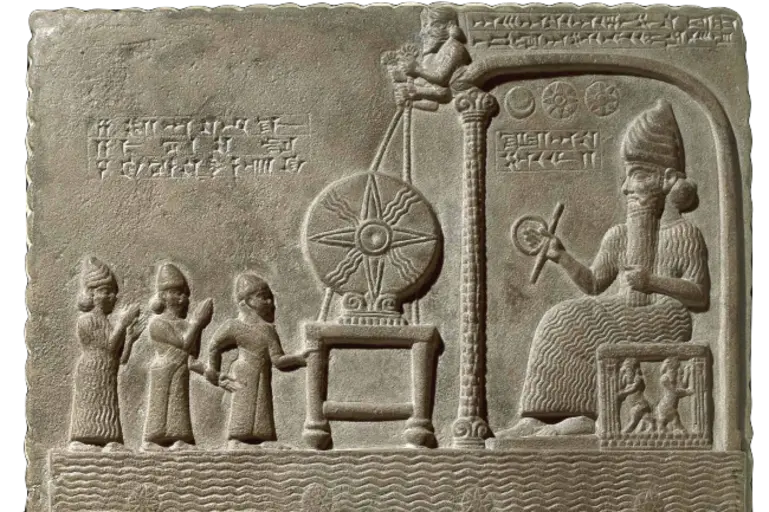
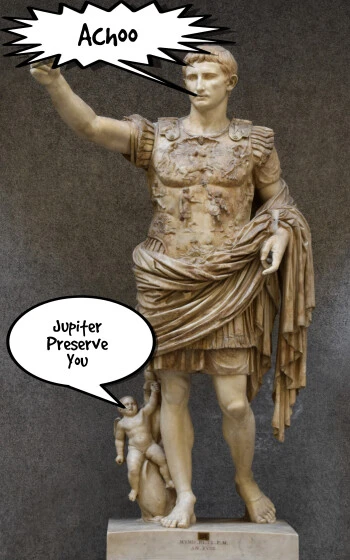
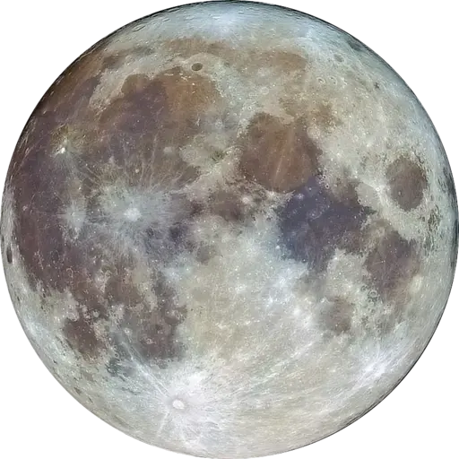
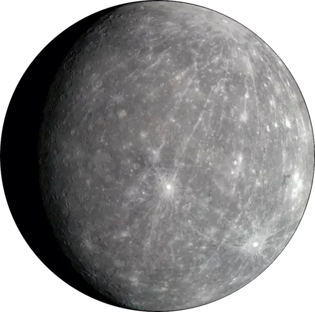
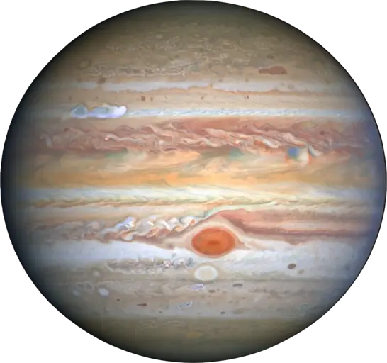
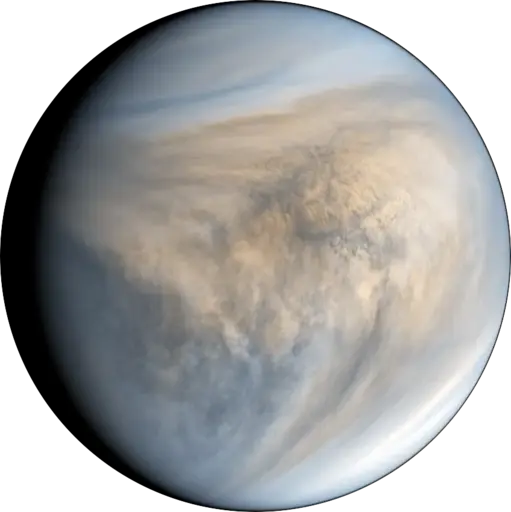
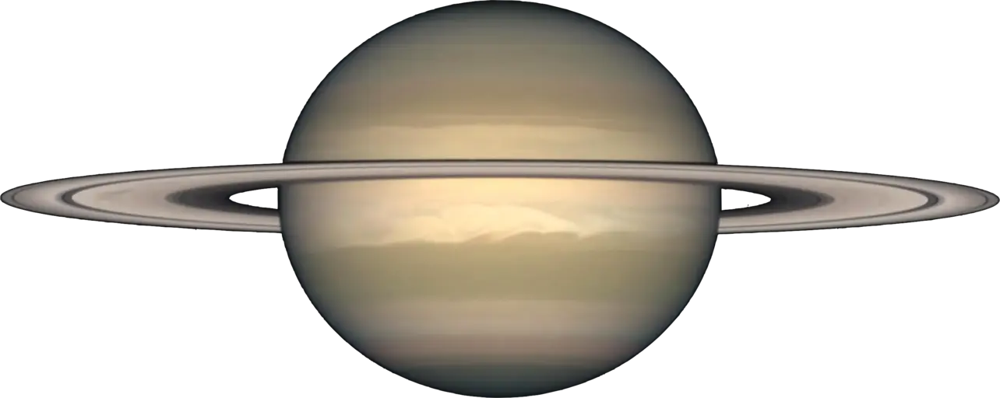

Long ago, the Babylonians looked up at the sky and saw seven bright objects that moved differently from the stars. The Babylonians were the first culture to study the motions of planets, though at the time they thought these objects were magical gods and goddesses rather than planets.

The Babylonians named the seven days of the week after the gods in the sky. The Sun was called Shamesh, the Moon god was called Sin, the Mars god was Nergal, Mercury was Nabu, Jupiter was Marduk, Venus was Ishtar, and Saturn was Ninurta. The gods were believed to be most powerful on their day of the week. The Babylonians also believed that Ishtar (Venus) was associated with love and that if you made a wish while looking at Venus, your wish would come true.

Some time later, when the Romans took over, they changed the day names to match their gods. The Roman god of the Sun was called Sol, the Moon goddess was called Luna, Mars was the god of war, Mercury was the god of wisdom, Jupiter was the god of thunder, Venus was the goddess of love, and Saturn was the god of agriculture.

The Romans believed that Jupiter brought you luck and Saturn controlled the harvest. They also believed that if you sneezed, it was because someone was talking about you behind your back. To protect someone from harm after sneezing, they would say "Jupiter preserve you."

When the Saxons gained power, they brought their own gods' names. The Saxon god of the Sun was named Sunna, the Moon goddess was named Mōna, Tiw was the god of war, Woden was the god of wisdom, Thor was the god of thunder, Frigg was the goddess of love, and Saturn was kept was the god of agriculture.

The Saxons believed that if you were born on a Wednesday (Woden's day), you would be clever and a good communicator.

| *Woden's day people rule* |
|:--:|
|  |

You may recognize the Saxon names, as the Engish adopted the Saxon names: Sunday for Sunna, Monday for Mōna, Tuesday for Tiw, Wednesday for Woden, Thursday for Thor, Friday for Frigg, and Saturday for Saturn.

||||||||
|---|---|---|---|---|---|---|
|Shamesh|Sin|Nergal|Nabu|Marduk|Ishtar|Ninurta|
|Sol|Luna|Mars|Mercury|Jupiter|Venus|Saturn|
|Sunna|Mōna|Tiw|Woden|Thor|Frigg|Saturn|
|Sunday|Monday|Tuesday|Wednesday|Thursday|Friday|Saturday|

So while you may not rely on Venus for love or Saturn for growing corn, perhaps you still ask for a blessing after sneezing. Or perhaps you were lucky enough to be born on Woden's day. Either way, you can now think about the planets every day of the week.

